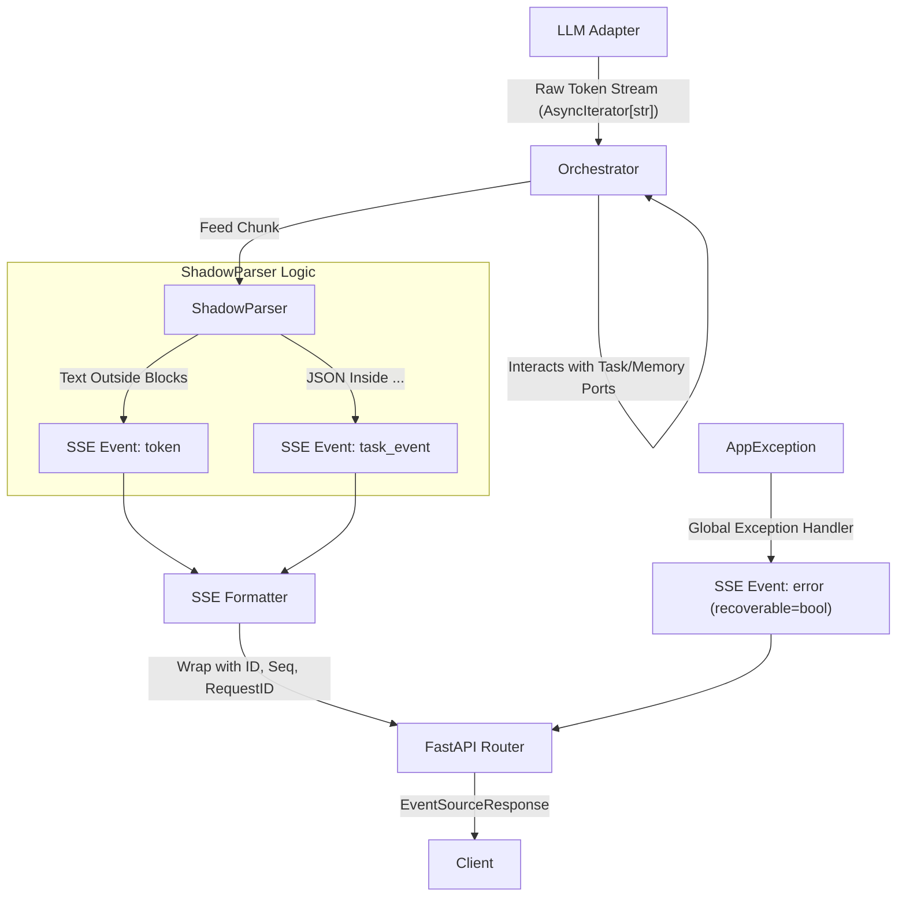

```
backend/
├── .env.example             # 环境变量模版（含 LLM\_PROVIDER, DB\_URL 等）
├── .gitignore               # Python/Docker/IDE 忽略项
├── docker-compose.yml       # 集成 PG(pgvector), ChromaDB, Redis
├── pyproject.toml           # Ruff/Pyright 严格模式配置与依赖管理
├── README.md                # 项目简介与启动指南
├── src/                     # 源代码核心目录 (pyright --strict 强制校验)
│   ├── core/                # 领域核心层（不依赖任何外部框架）
│   │   ├── models/          # 领域模型 (Entity/ValueObject)
│   │   ├── ports/           # 依赖倒置接口 (LLMStreamPort, TaskPort 等)
│   │   ├── exceptions/      # AppException, ErrorCode 强类型枚举
│   │   └── security/        # 权限与 JWT 核心逻辑
│   ├── services/            # 业务逻辑编排层
│   │   ├── orchestrator.py  # HTN 编排器（任务拆分、状态机跟踪）
│   │   └── companion.py     # 人格化陪伴逻辑（心智状态驱动）
│   ├── routers/             # API 路由层 (FastAPI)
│   │   ├── api\_v1/          # 版本化 REST 接口
│   │   └── streams/         # SSE 流式推送接口
│   ├── parsers/             # 流解析层
│   │   └── shadow\_parser.py # 增量解析标记块 (ShadowParser)
│   ├── infra/               # 基础设施实现层 (Adapters)
│   │   ├── db/              # SQLAlchemy 异步实现与 Repositories
│   │   ├── llm\_adapters/    # OpenAI/Anthropic 多供应商适配器
│   │   └── cache/           # Redis/ChromaDB 客户端封装
│   ├── schemas/             # Pydantic V2 校验模型 (单一真相源)
│   │   ├── htn.py           # 任务树与计划模型
│   │   ├── sse.py           # 严格的 SSE 帧定义
│   │   └── common.py        # ErrorResponse 统一包装
│   ├── workers/             # 异步工作进程
│   │   └── outbox\_worker.py # 负责 PG 到 ChromaDB 的幂等搬运
│   └── main.py              # FastAPI 入口与全局异常拦截器
├── tests/                   # 测试套件 (Pytest)
│   ├── unit/                # 单元测试
│   └── integration/         # 集成测试
└── docs/                    # 架构与开发文档
└── agents/              # AI Agent 专属约束文档
```



